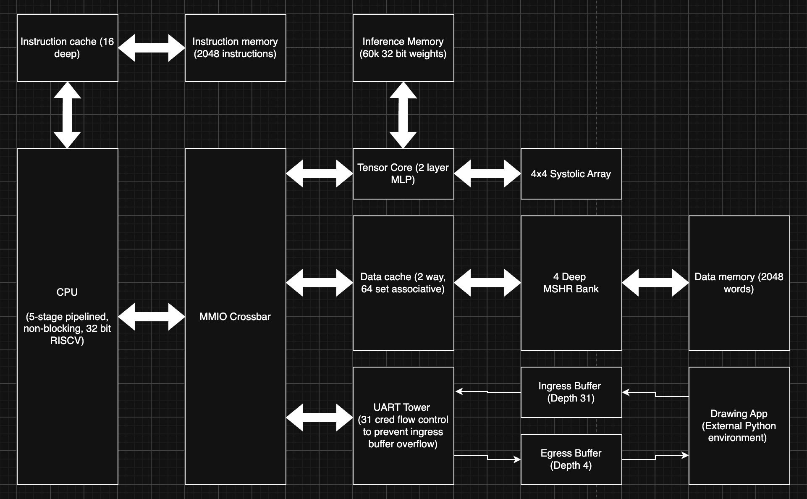

# Shape Inference SoC

An FPGA SoC that accepts four hand-drawn shapes over UART, classifies them with
an integer MLP accelerator, and returns a class for each quadrant. The current
top level targets the ECP5-85K ULX3S board and runs the complete CPU, cache,
UART, and tensor path in one 12.5 MHz clock domain.



## System flow

1. The desktop app connects at 115200 baud and waits in **INIT**. On FPGA reset,
   the UART tower sends a 31-credit reset grant followed by the CPU's `0x00`
   initialization byte; the app then enters **DRAW**.
2. The user draws one shape in each 240 x 240 quadrant and presses **Submit**.
3. The app compresses each quadrant to a 60 x 60 binary image and uploads all
   four images while obeying the UART credit limit.
4. The CPU repacks the received 30-bit payloads into data-cache words, then
   streams corresponding pixels from all four quadrants to the tensor core.
5. The accelerator evaluates the MLP and returns four one-hot class results.
   The UART tower converts and sends them as a two-byte header/payload reply.
6. The app displays ideal line, square, or circle overlays in **DONE**. **Next**
   clears the canvas locally and returns directly to **DRAW** for another round.

## Implementation snapshot

| Item | Current result |
| --- | --- |
| FPGA / package | Lattice ECP5-85K / CABGA381 (ULX3S) |
| Configured SoC clock | 12.5 MHz |
| Post-route maximum frequency | **24.65 MHz** |
| Packed logic | 23,835 / 83,640 `TRELLIS_COMB` (28%) |
| Flip-flops | 5,362 / 83,640 (6%) |
| Block RAM | 128 / 208 DP16KD (61%) |
| Distributed RAM | 256 / 10,455 `TRELLIS_RAMW` (2%) |
| DSP multipliers | 17 / 156 `MULT18X18D` (10%) |
| Yosys logic estimate | 19,689 LUT4 |

These are the final router2 results for the integrated UART build. The 24.65
MHz figure is a post-route timing estimate; the shipped top level stays at
12.5 MHz for margin. See [the synthesis record](synth_changes/README.md) for
the optimization history and equivalence notes.

## CPU and memory system

The processor is a five-stage RV32I pipeline with fetch, decode, execute,
memory, and writeback stages. It implements the integer ALU, branches,
`JAL`/`JALR`, and word loads/stores needed by the inference firmware. Results
from the memory and writeback stages are forwarded into execute to avoid
unnecessary register-dependency stalls.

The 64-byte instruction cache holds 16 instructions from one aligned block.
The data cache is 512 bytes: 64 sets, two ways, one 32-bit word per line, with
dirty writeback and MRU-based replacement.

The 4 MSHRs (miss status holding registers) allow for load and store misses
from d-cache to be non-blocking. Loads require 2 MSHRs since the dirty cache
line it replaces needs to be written in addition to the actual load. CPU
records destination registers for instructions in the MSHR bank, and stalls
the pipeline if later instructions are dependent on MSHR instructions.

## Drawing input and compression

Each of the four 240 x 240 quadrants is stored as binary pixels (`1` means
ink). Every non-overlapping 4 x 4 cluster is OR-reduced, producing one 60 x 60
input image, or 3,600 bits, per quadrant. The app traverses Q1 through Q4 in
row-major order and packs 30 pixels into bits `[29:0]` of each word. Bit 30 is
the valid marker and bit 31 marks the final word of Q4. Words go over UART least
significant byte first: 120 words per quadrant and 1,920 bytes per drawing.

The CPU removes the markers and repacks each quadrant into 113 32-bit cache
words. During inference it combines matching bytes from the four quadrant
buffers, so each systolic-array column processes a different drawing while the
rows process neurons.

## Integer MLP accelerator

The model is a fully connected `3600 -> 64 -> 3` MLP:

```text
binary pixels -> int8 W1 / int32 accumulate + b1 -> ReLU -> requantize
              -> int8 W2 / int32 accumulate + b2 -> argmax
```

ReLU clamps negative hidden-layer accumulators to zero. Hidden activations are
rounded, shifted right by six, and saturated to `[0, 127]`; weights use signed,
symmetric per-tensor int8 quantization and biases remain in the corresponding
int32 accumulator domain. The exported integer model reaches 98.39% validation
accuracy, versus 98.44% for the float model, with 99.94% agreement between
their predicted classes.

Training uses PyTorch and procedurally generated 60 x 60 circles, squares, and
lines with randomized size, position, thickness, orientation, rough edges,
broken strokes, pixel noise, and stroke dropout. The default run uses 2,000
training and 600 validation samples per class for 20 Adam epochs. Model labels
are `0=circle`, `1=square`, and `2=line`.

[`weight_to_memh.py`](mlp_model/weight_to_memh.py) packs four first-layer
weights per 32-bit word, followed by the first-layer biases, three second-layer
weights per word, and the output biases. The active 57,731-word
[`mlp_weights.memh`](memh/mlp_weights.memh) initializes the tensor block ROM
when the bitstream is built; the current SoC does not load weights through CPU
assembly at startup. The controller reads W1 sequentially in groups of four neurons,
runs four quadrant inputs in parallel through a 4 x 4 systolic array, stores 64
hidden activations per quadrant in banks, then reads W2 and produces three
scores per quadrant. Hardware outputs are one-hot: `001=line`, `010=square`,
and `100=circle`.

## UART transport and flow control

The link is 115200-baud 8N1. Its 31-byte ingress FIFO carries the large app-to-
FPGA pixel stream; the CPU can consume either one byte or four bytes through
MMIO. The four-byte egress FIFO only carries sparse FPGA-to-app traffic:
batched credit grants, initialization, and the two-byte classification result.
It therefore does not need to match the size of the pixel upload buffer.

Each received app byte consumes one credit. Hardware initially grants 31
credits with `0x5F`, which also tells the app that the FPGA reset, and later
returns a grant whenever at least eight freed entries have accumulated. Because
grants lag actual FIFO reads, the app's credit count is conservative: stopping
at zero guarantees it cannot write more bytes than the hardware has space for.
No standard serial flow control is used. RTS (Request to Send) and CTS (Clear
to Send) are dedicated hardware signals that tell the other endpoint when it
may transmit. XON/XOFF uses special pause and resume bytes inside the data
stream. This project disables them and uses its own byte-credit messages.

CPU-to-app control bytes are `01cccccc` for a credit grant, `0x00` for
initialization, and `0x80` followed by `[Q4:2][Q3:2][Q2:2][Q1:2]` for results.
The two-bit result codes are `01=line`, `10=square`, and `11=circle`. The app
sends only credited pixel bytes; **Next** sends no completion byte. See
[`drawing_app/flow.md`](drawing_app/flow.md) for the exact state machine,
packing rules, and reset limitation.

## Build and run

Build all RTL files and program volatile FPGA SRAM:

```sh
make bitstream SRCS='src/*.sv'
make flash SRCS='src/*.sv'
```

Compile and run a SystemVerilog testbench with Icarus Verilog. Use `wave` to
run the same test and open the generated VCD in GTKWave:

```sh
make sim TB=tb_icache
make wave TB=tb_icache
```

Then launch the drawing app from the repository root and reset the FPGA after
the serial connection opens:

```sh
source drawing_app/.venv/bin/activate
python -m drawing_app --port /dev/cu.usbserial-DEVICE --baud 115200
```

The full app setup and demo instructions are in
[`drawing_app/README.md`](drawing_app/README.md). The FPGA pinout is in
[`constraints/ulx3s_v20.lpf`](constraints/ulx3s_v20.lpf), and the CPU program
source is [`assembly/final_prog.asm`](assembly/final_prog.asm).
